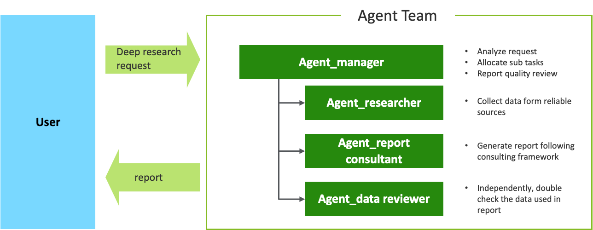
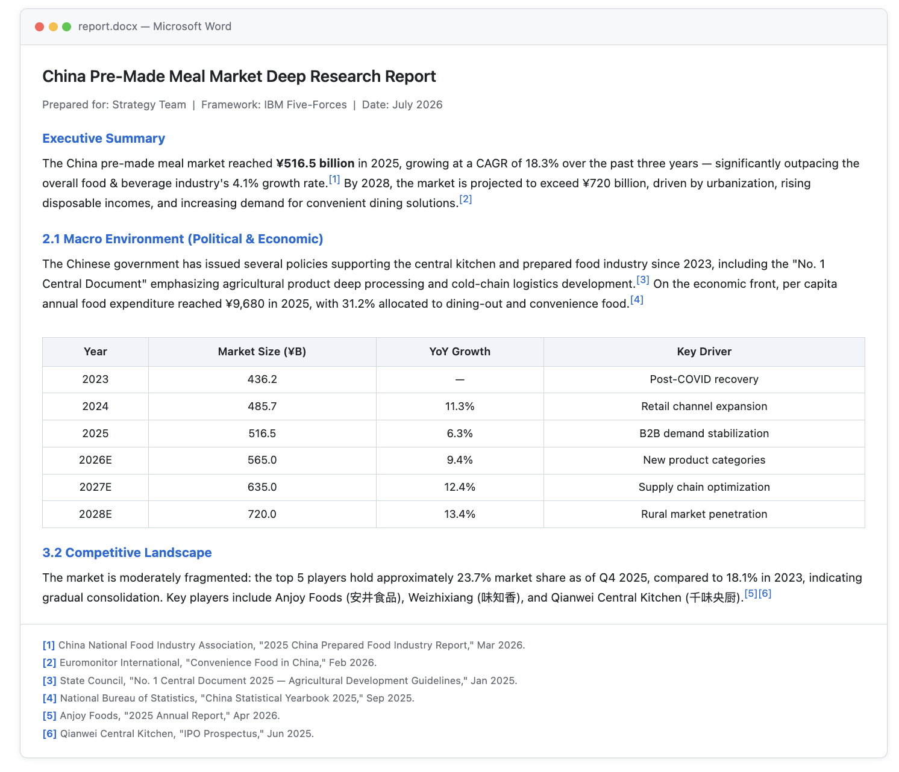
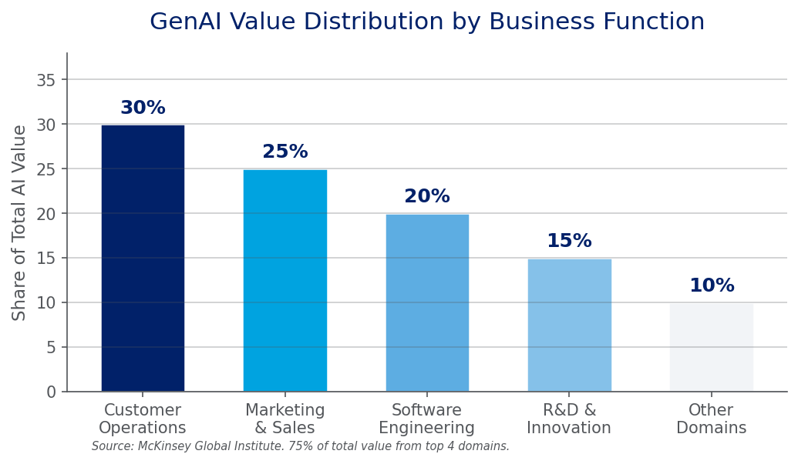
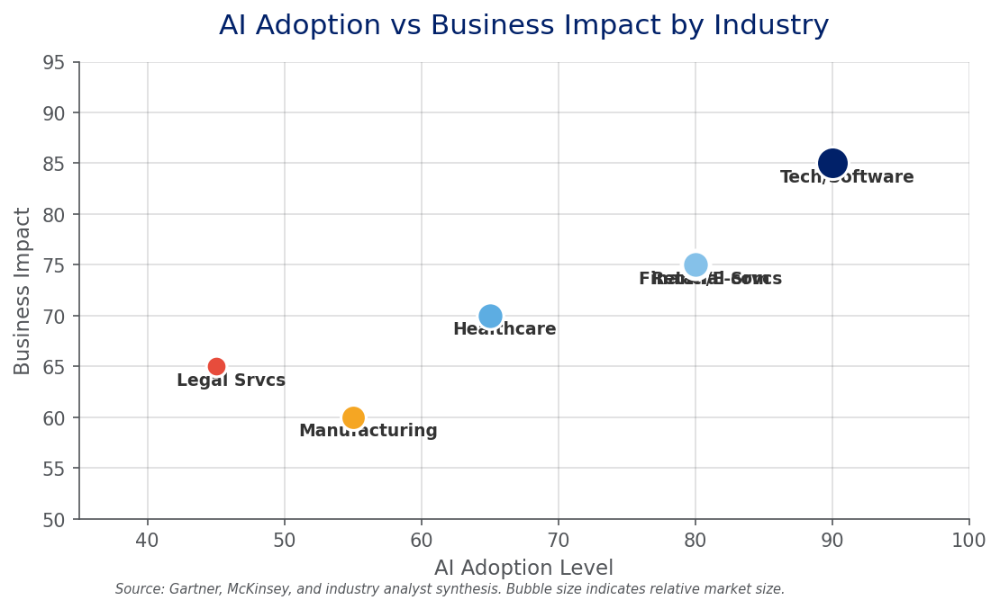

# Multi-Agent Deep Research

An open-source alternative to Google Gemini Deep Research. Uses a **4-role Agent collaborative architecture** that simulates how a real consulting team works, automatically generating in-depth research reports with academic citation footnotes.

## Highlights

- **4-Role Architecture**: Agent-manager (planning + QA + delivery) + Agent-researcher (search + data) + Agent-report consultant (writing + visualization self-check) + Agent-data reviewer (independent data verification)
- **5 Decision Gates**: User and Agent-manager can send work back upstream at key checkpoints to ensure quality. Plus mandatory visualization compliance check before output
- **Visualization Gate**: Prevents text-only reports — forces trend data into charts, hierarchies into diagrams, timelines into structured tables. Pandoc mechanical conversion explicitly forbidden
- **Source Priority Pyramid**: Annual reports/broker research > government data > authoritative media > corporate websites, with strict blacklist filtering
- **Anti-Hallucination**: research_data.json persistence + Agent-data reviewer independent review + scripts forbidden from hardcoding numbers
- **Dual Format Output**: .docx (with citation superscripts + bibliography) + .pptx (thesis-statement-driven consulting-grade slides)
- **Consulting Framework Library**: IBM Five-Forces by default, supports PEST/Porter's Five Forces/SWOT/3C/BCG Matrix
- **Completely Free**: Uses DuckDuckGo search, no API key required, unlimited usage

## Key Differences from Gemini Deep Research

| Dimension | Gemini Deep Research | This Skill |
|-----------|---------------------|------------|
| Execution Model | Single submission | Multi-Agent collaboration + human intervention |
| Data Verification | Relies on search ranking | Independent agent dedicated to data review |
| Quality Control | One-shot output | 4 decision gates, supports multiple rounds of revision |
| Anti-Hallucination | Relies on model capability | JSON persistence + independent review + no hardcoded numbers |
| Free Tier | ~5-6 per month | Unlimited |

## Quick Start

### Install the Skill

```bash
git clone https://github.com/yslicn/multi-agent-deep-research.git
cd multi-agent-deep-research
cp -r . ~/.claude/skills/deep-research
```

### Platform Compatibility

This is a **prompt-based skill** — `SKILL.md` contains the complete consulting workflow. Any AI agent can follow it.

| Platform | How to Load |
|----------|-------------|
| **Claude Code** | `cp -r . ~/.claude/skills/deep-research/` then type `/deep-research` |
| **OpenCode** | Add `SKILL.md` as a project rule or skill file |
| **Codex** | Load `SKILL.md` via cc-switch as a project instruction |
| **Hermes** | Import `SKILL.md` as a skill definition |
| **Any Agent** | Paste `SKILL.md` content into system prompt or custom instructions |

### Start Researching

```
Help me research the China pre-made meal market using the Five-Forces framework
```

## View Sample Reports

See full-length reports generated by this system — with structured sections, data tables, charts, and academic-grade citations.

[](https://yslicn.github.io/multi-agent-deep-research/report.html)
[](https://yslicn.github.io/multi-agent-deep-research/report-cn.html)

## How It Works

The system employs 4 specialized AI agents that work together in a structured pipeline — each agent has a distinct role, and data flows sequentially from one to the next with built-in feedback loops for quality assurance.



### 10-Step Workflow with 5 Decision Gates

1. User submits research request
2. Agent-manager analyzes and proposes research approach → **Gate 1**: User approves?
3. Agent-manager breaks down tasks and assigns to agents
4. Agent-researcher executes web search, collects data
5. Agent-report consultant integrates data, writes draft report
6. **Visualization self-check**: trend data → charts, hierarchies → diagrams, timelines → tables → **Gate 2**
7. Agent-data reviewer independently verifies all cited data → **Gate 3**: Data trustworthy?
8. Agent-manager evaluates report quality (incl. visualization compliance) → **Gate 4**: Quality meets standards?
9. Agent-manager delivers report with push notification
10. User receives report → **Gate 5**: Requirements satisfied?

## Report Sample

### .docx Research Report

Automatically generated with academic-grade citation superscripts, structured sections, data tables, and charts. **[View the full report online](https://yslicn.github.io/multi-agent-deep-research/report.html)** for the complete reading experience.





### .pptx Consulting Presentation

Each slide title is a complete thesis statement (not a noun phrase), with data cards and source annotations as required by consulting standards. Note: the pptx output quality is currently limited and still under active development.

## Research Frameworks

| Framework | Analysis Dimensions | Best For |
|-----------|-------------------|----------|
| IBM Five-Forces (default) | Macro, Industry, Customer, Competitor, Self | Comprehensive industry research, strategy |
| PEST | Political, Economic, Social, Technological | Macro environment analysis |
| Porter's Five Forces | Supplier power, Buyer power, New entrants, Substitutes, Rivalry | Industry structure analysis |
| SWOT | Strengths, Weaknesses, Opportunities, Threats | Company/product diagnosis |
| 3C Model | Company, Customer, Competitor | Competitive positioning |
| BCG Matrix | Market growth vs Relative market share | Product portfolio analysis |

## Output Structure

Each research project produces:

```
workspace/[project-name]/
  research_data.json      # Persistent data store (single source of truth)
  report.md               # Full report in Markdown
  report.docx             # Formatted Word report with citations
  review_report.json      # Data reviewer verification report
```

## Quality Standards

- Every key data point must have a source citation footnote [n]
- Each data point must be verified by at least 2 independent sources
- Data credibility is graded: high / medium / low
- Report length: 8,000–15,000 words (standard), ≥12,000 (deep)
- Reports must include charts (tables, bar charts, line charts)
- Agent-data reviewer must independently verify all data (cannot reuse Agent-researcher's search results)

## Source Blacklist

The following sources are **strictly prohibited**:
- Baidu Baike, Sogou Baike, 360 Baike (no editorial review)
- Baidu Baijiahao and other unverified self-media
- Weibo, X (Twitter), and other social media
- Content without date, author, or source attribution
- Personal blogs and unverified forum comments

## Limitations

- Relies on publicly available web information; cannot access paywalled databases (Euromonitor, Wind, IBISWorld)
- Data timeliness depends on search tool accessibility
- For highly specialized domains, human review is recommended
- DuckDuckGo search breadth is lower than Google; supplement with other channels when needed
- Agent-data reviewer's independent verification is also limited to public sources
- Model-calculated estimates should be treated as reference, not primary data
- The quality of pptx format is poor by now, still working on it

## License

MIT
